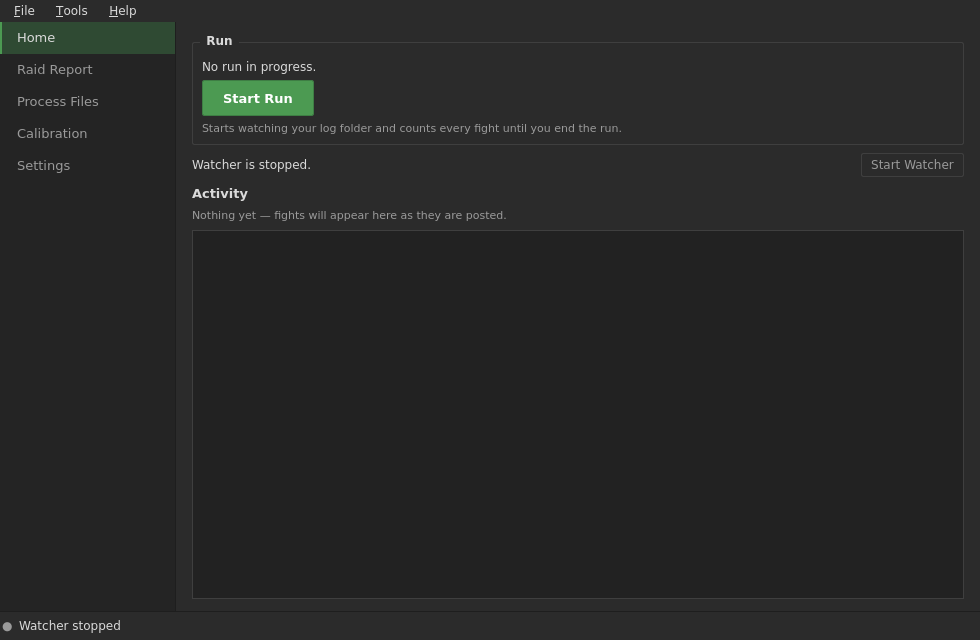
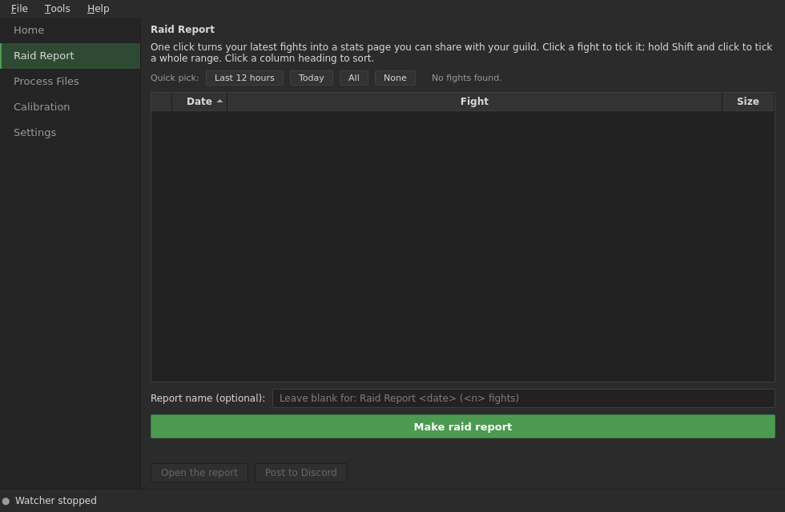
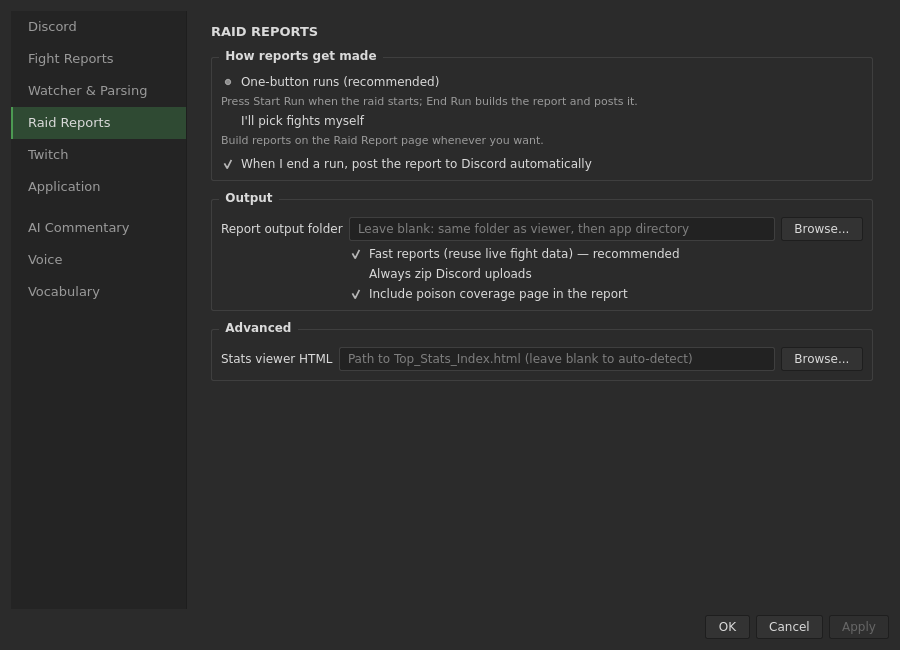
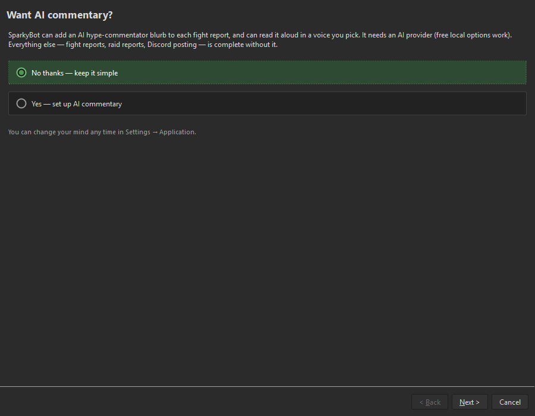
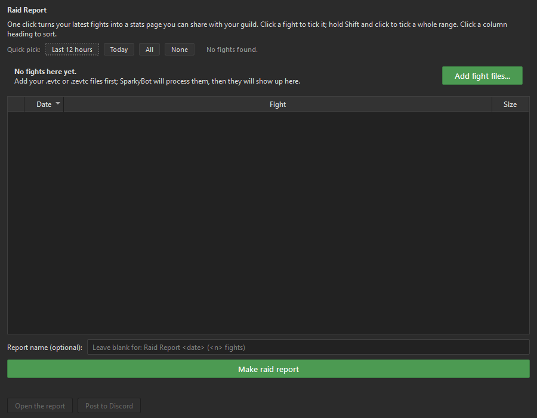

# SparkyBot

### The unhinged AI shot-caller that watches your Guild Wars 2 WvW logs, does the math, and roasts your squad in real time — on Discord *and* Twitch, with a voice if you want one. When the raid's over, it builds a complete statistical autopsy of your entire run.

You fought. You died (a little). ArcDPS wrote a log. **Before you've finished typing "gg," SparkyBot has parsed the whole fight, found the one stat that actually mattered, and posted something meaner and funnier than your guildies were about to.**

Not affiliated with ArenaNet. Barely affiliated with good taste. Extremely good at its job.

> ⚠️ Sparky's default prompt talks trash. Loudly. It's competitive-gaming humor about a video game — and it roasts *your own squad* at least as hard as the enemy. Want it polite? Edit the system prompt in Settings. We won't judge. (We will, a little.)

---

  

---

## What's New in 2.0 — *"It Has a Front Door Now"*

Version 2.0 gives SparkyBot a Home screen, sidebar navigation, and Settings
grouped around the jobs you want to accomplish.

- **Start Run. End Run. Report done.** SparkyBot counts the fights, remembers
  an open run after a restart, includes copied or manually processed logs,
  builds the report, and can post it to Discord. You raid; it handles the
  paperwork.
- **Raid Reports without the ritual.** Pick the last 12 hours, today, or only
  the fights you want. Reports reuse work SparkyBot already did, generate
  faster, and shrink themselves so Discord is less likely to throw a fit.
- **A Home screen that tells you what happened.** Posted fights, skipped
  fights, detected/processing status, commentary, voice, and reports land in
  one activity feed. Drop log files straight onto the window when you want to
  process them manually.
- **AI is optional.** Decline it in setup and SparkyBot stays focused on fight
  reports and Raid Reports. You can enable AI commentary and voice later.
- **Native Windows installer.** Download, double-click, done. No Python
  scavenger hunt and no command prompt audition.

Reports include clearer progress and errors, safer filenames, smaller
temporary files, and automatic cleanup.

The first-run wizard walks through report workflow and optional AI features.
Empty Raid Report and Calibration pages explain what they need and provide a
direct action to continue.

  

---

## 🔥 What's New in 1.8.0 — *"Grades on YOUR Curve"*

Sparky's performance tiers used to be carved from a stock corpus of 800-some fights. Fine — but that's not *your* guild. **Now you can retune the entire grading curve to your own server, right from the Settings window. No spreadsheet, no code, no asking nicely.**

Point the new **Calibration** tab at a pile of your `.evtc` logs, pick how many to grind through at once — up to **32 in parallel**, so a backlog that used to take *days* takes minutes — and when it's done it throws up a preview showing exactly how every tier moves: old → new, ↑ or ↓, color-coded, before you commit a thing. Run a sweat-lord guild? "Dominant" healing might jump +20% because your healers actually *heal*. Run a feeder comp? The bar drops to match reality. Either way it's **honest to a fault** — the numbers come straight out of your own fights, nothing invented, and a loud warning fires if you try to calibrate off too few of them. It even offers to recalibrate the *instant* an import finishes, because remembering to click a button is beneath you and we know it.

The bot stops grading you against strangers and starts grading you against the only people who matter: your own squad, on its best and worst nights.

---

## 🔥 What's New in 1.7.5 — *"It Remembers Its Own Tics"*

Sparky now holds a *grudge*. It keeps a permanent rap sheet of its own verbal crutches across all of history — lean on a pet phrase too many times and it gets blacklisted automatically (no human maintains the list; it narcs on itself). And a player on cooldown now gets their stats **deleted from what the model can even see**, so it can't gush about the same hero under a fake nickname. Their numbers still count toward squad totals — they're benched from the spotlight, not erased.

This builds on 1.7.0's **Anti-Slop Update**: an anti-repetition engine that benches any phrase, verb, or player name it reuses; a "Narrative Facts" prompt that hands the model curated truth instead of a JSON firehose; stochastic seeding to knock it off its favorite ruts; and a silent-failure guard that retries empty "I thought about it" responses. Overkill for jokes about a video game? Absolutely. Did we do it anyway? Obviously.

---

## What It Does

After a fight ends and ArcDPS writes a log, you get a full combat report in seconds:

- **AI Fight Commentary** (optional) — hype, unhinged narration from any OpenAI-compatible LLM, never repeating its own bits, with optional TTS and Discord audio
- **Quick Report** — KDR, duration, squad/enemy downs, kills, deaths
- **Squad & Enemy Summaries** — player counts by team color, total damage, DPS
- **Detailed Stats** — damage, burst, strips, cleanses, heals, defense, CCs, downs/kills
- **Boon Uptime** — defensive and offensive boons per subgroup
- **Enemy Intel** — top damage skills, composition by profession and color

Discord gets color-coded code blocks with configurable guild icons; Twitch gets a plain-text summary plus commentary. **Enemy players are never named — only their professions. We roast comps, not strangers.**

---

## Setup

### Prerequisites

1. **.NET 8.0 Desktop Runtime** from [Microsoft](https://dotnet.microsoft.com/en-us/download/dotnet/8.0)
2. **ArcDPS** from [deltaconnected.com/arcdps](https://www.deltaconnected.com/arcdps/)

### Install

1. Download `SparkyBot-v2.0.2-setup.exe` from the [Releases page](https://github.com/SimpleHonors/SparkyBot/releases).
2. Double-click it.
3. Launch SparkyBot.

On first launch the setup wizard handles the essentials. You do not need
Python or a command line. Source installs remain available for people who
enjoy owning more screwdrivers than furniture.

### Discord

Channel → gear icon (Edit Channel) → **Integrations** → **Webhooks** → **New Webhook** → **Copy Webhook URL**. Paste it into the setup wizard or Settings → Messaging.

Guild admins configure the Discord destinations once and choose **File →
Create Guild Setup File...**. A guildie chooses that file on first launch or
uses **File → Use Guild Setup File...** later. SparkyBot shows exactly where
individual fights and the end-of-night debrief will post. On first launch it
then checks only the parser and fight-log folder on that computer; AI, voice,
Twitch, and other extras stay off and can be added later in Settings.

For every first-run setup—with or without a guild file—SparkyBot checks common
and Steam GW2 locations, validates candidates with the real game executable,
finds every ArcDPS setup it can prove, and reads ArcDPS's configured log
folder. If there are multiple installs, you choose the right one. Nothing is
saved until SparkyBot shows the exact locations and you accept them; unusual
installs can point SparkyBot directly at `arcdps.ini`.

The setup file contains only the three Discord webhook slots, destination
names/routing, enabled state, bot name, and embed color. It never contains AI
provider keys, Twitch tokens, voice keys, or local paths.

> **Treat an exported guild config like a password.** Its Discord webhook URLs
> can post to your channels. Share it privately and revoke the webhooks in
> Discord if the file is exposed.

### Switching to or from another log tool

SparkyBot should earn your use, not trap your setup. On first launch it quietly
checks for AxiBridge, TopStatsAIO, PlenBot, MzFightReporter, WvW Insights, the
Drevarr tools, and other supported ArcDPS workflows. When one is found, the
first action names it plainly: **Found PlenBot — set me up from it**. When none
is found, that feature is completely absent. A collapsed **Advanced** path asks
experienced users which app they run, then opens that app's expected settings
file and folder.

Before anything moves, SparkyBot previews the exact log folder, named Discord
routes, and every safe matching preference grouped by section. Bot tokens, API
keys, passwords, account data, and history never transfer, and the source tool
is never changed. These choices form the base setup; a guild file added next
overrides its Discord channels and presentation while local paths, thresholds,
and other non-overlapping preferences stay.

Choose **File → Create Setup for Another Log Tool...** to go the other way.
SparkyBot can create real settings for AxiBridge, TopStatsAIO, PlenBot,
MzFightReporter, WvW Insights, EVTC_parser, and GW2 EI Log Combiner. Unknown
settings are preserved, existing files are backed up, and the app clearly
names anything that cannot transfer. This is a one-time, user-approved
move—not a background sync process.

SparkyBot directly relies on some projects, was genuinely influenced by a few,
and simply interoperates with or documents others. The linked
[interoperability guide](docs/WVW_LOG_TOOL_INTEROPERABILITY.md) names the exact
relationship, says where each tool may be the better fit, lists every adapter,
and documents the license boundary. No competitor source code or assets are
copied by the migration feature.

### Twitch

1. Use (or make) a Twitch account for the bot
2. Get an Access Token at [twitchtokengenerator.com](https://twitchtokengenerator.com)
3. Settings → Messaging → enter Channel Name + Bot Token, check **Enable Twitch Bot**
4. Hit **Test Connection** — a test message should land in your chat

---

## Configuration

Everything lives in the GUI (right-click the system tray icon → Settings); the wizard covers the essentials on first launch. Highlights:

- **Messaging** — up to 3 Discord webhooks, Twitch channel/token, embed color, guild icon
- **Paths** — ArcDPS log folder, GW2EI CLI path, network poll interval
- **Thresholds** — min fight duration/downs/damage to filter trivial fights
- **Display** — toggle individual report sections
- **Behavior** — for hands-free: enable Start with Windows + Hide Console + Start Minimized + Start Watcher, then never think about it again

**AI Settings:** pick a **Provider** preset or set a custom **base URL**, drop in your **API Key** (blank for local models), choose a **Model**, and tweak the **System Prompt** in the full editor (with Reset to Default). Commentary posts as a separate embed *after* the fight report, so it **never delays your stats** — it retries on failure, and the silent-failure guard catches empty responses.

**TTS (optional):** reads commentary aloud and/or attaches audio to Discord. Choose `edge` (free Microsoft neural voices), `elevenlabs` (API key, with voice/stability/style controls), or `local` (a self-hosted OpenAI-compatible speech server — point it at your own voice-cloning endpoint such as Chatterbox, pick a voice from the server, or upload a short reference sample that gets cloned at generation time; free and fully private).

---

## AI Model Recommendations

Sparky works with **any** OpenAI-compatible API. Models were graded across real WvW fights on rule compliance, narrative quality, and variety.

- **Free & great:** Gemini 2.5 Flash — fast (~1.4s), perfect 20/20, free key at [Google AI Studio](https://aistudio.google.com/apikey)
- **Top quality:** GPT-5.4 Mini (20/20, ~1.4s) and Grok 4.20 (20/20, ~1.1s)
- **Cheapest good pick:** DeepSeek V3.2 — 20/20 at ~$0.09 per 100 fights
- **One key for all of them:** [OpenRouter](https://openrouter.ai/)

A typical 20-fight night runs **less than a penny** on Gemini, ~2 cents on DeepSeek, ~6 cents on GPT-5.4 Mini. A full night of professional-grade roasting costs less than the repair bill on one bad push.

---

## How It Works

- **Watching** — local folders use OS-native events (`watchdog`) for instant detection; network shares fall back to polling. Files at startup are skipped; each new one is processed once.
- **Parsing** — GW2 Elite Insights CLI turns ArcDPS `.evtc` logs into JSON.
- **Pre-analysis** — before a single token hits the model, Sparky buckets the fight into qualitative tags (calibrated against recorded fights), applies player/topic cooldowns, and builds the "Narrative Facts" it's allowed to talk about. The AI gets *curated truth*, not a firehose.
- **Posting** — Discord splits into batched embeds within API limits; Twitch sends plain-text within the 500-char cap, TLS by default.

**Command line:** `python bootstrap.py` accepts `--verbose`, `--headless`, `--config PATH`, and `--debug-ai-prompt`.

---

## How Sparky Knows You Balled Out

Here's the problem with "good": 4,000 DPS is a war crime in a 90-second gank and a nap in a 10-minute slugfest, and a healer's sheet looks nothing like a zerker's. So Sparky does **not** do hardcoded "good = big number" garbage. It grades you **on a curve against 800+ real WvW fights** — every number gets ranked against everyone who's actually thrown down. No vibes. Receipts.

Five tiers, by percentile. Clear the floor or Sparky doesn't even bring you up — no participation trophies in here:

| Tier | You beat… | Translation |
|------|:---------:|-------------|
| `solid` | 25% | you showed up and did a thing |
| `strong` | 50% | comfortably above the middle |
| `dominant` | 75% | you're carrying |
| `exceptional` | 90% | one of the best bodies on the field |
| `legendary` | 95% | the stat line screenshotted into guild chat |

And it grades **everything** independently — healing, cleanses, strips, hard CC, burst, downs, kills, stability, boon gen — all normalized per-second so the grind and the gank get a fair trial. *(For the nerds: clear ~5,500 DPS/sec and you're top-5% of every fight on record.)*

**But here's what lazy stat sheets miss.** Standing in the blob mashing `1` racks up "damage" — *winning* happens at the decisive moment. So Sparky stalks two killer axes: damage into **downed** enemies (finishing the kill before they rally) and healing into your own **downed** bodies (ripping a teammate off the floor mid-wipe). Go off on either and you get tagged **clutch** — the closer.

Then it fingerprints your stat shape against your class to figure out *what you actually were* — `burst evoker`, `rez druid`, `boon DPS` — and spotlights your single most unhinged number instead of parroting the damage chart.

> **And it's YOUR blood, not some stranger's.** Don't like being graded against a stock corpus? **Settings → Calibration**: feed it a batch of your guild's logs (32 at a time), watch a preview show exactly how every tier moves up or down, and apply. The curve becomes *your* server's meta — the bar rises where your crew is filthy and drops where it isn't. Honest numbers, your fights, one click. (See *What's New in 1.8.0* up top.)

---

## Raid Report

Other tools make you wait. SparkyBot was already working the whole time you played — parsing every fight live, caching the results. By the time you call it a night, the heavy lifting is done. One click finishes the job.

### How it works

1. **Open the Raid Report tab** — it auto-discovers your logs and selects the last 12 hours. A line tells you how many fights are ready: *"N recent fights found — ready."*
2. **Click the big button** — **"Make my raid report."** SparkyBot reuses everything it already parsed live, downloads the stats builder on first use (one-time), and bakes a single self-contained HTML file. That one file includes a guided **Sparky** view, a fast **Simple** view, and the untouched **Classic** report; every reader can switch at the top. Progress shows inline: reading fights, crunching numbers, building the page. **Raid ends, click, done.**
3. **Post to Discord** — one more click sends a compact commander/run/K-D overview plus the report file to your guild's channel. You can also open the report in your browser first. Big reports auto-zip to fit Discord's attachment limit.

SparkyBot enables the combiner's compressed standalone-HTML path by default,
so a big end-of-night report often shrinks enough to post under Discord's
standard unpaid attachment limit instead of requiring paid upload headroom.
It stays one self-contained browser file. This compresses the generated
report, not your raw `.evtc` logs. The upstream combiner's
[v1.8.0 release](https://github.com/Drevarr/GW2_EI_log_combiner/releases/tag/v1.8.0)
credits SimpleHonors for submitting that capability; SparkyBot uses the
supported upstream option rather than maintaining a private fork.

Need to cherry-pick fights or name your report ("Wolf Wednesday")? The **Advanced** link in the bottom-right expands the full fight list, selection buttons, and an optional name field. Your last 12 hours are pre-selected every time, so you never have to touch Advanced unless you want to.

If anything goes wrong, you see a plain-text error right on the tab — no stack traces, no jargon. A **Show details** button reveals the full copyable message. Everything is also written to `sparkybot.log` next to the app.

### What's in it

The **Sparky** view starts with the night's totals and correctly labeled player rankings, then provides players, fights, poison coverage, and a direct path to every original detail. **Simple** keeps only the useful headlines. **Classic** is the byte-for-byte upstream report with its complete tables and charts. All three use **all the data from every fight in the session** and travel together in the same offline file.

### Cache & storage

The **parse cache** (on by default) means the Raid Report doesn't re-run GW2EI on logs SparkyBot already processed live. A full night's report generates in seconds. Cache entries live in a dated folder structure (`NightReportCache/YYYYMMDD/`), auto-clean after 48 hours, and a settings-change fingerprint silently invalidates them so you never serve stale data. The **records database** persists permanently — your best nights accumulate, not disappear.

### Credits

The stats engine is **GW2 Elite Insights** (baaron4/GW2-Elite-Insights-Parser) paired with the **GW2 EI Log Combiner** (Drevarr/GW2_EI_log_combiner). SparkyBot downloads the combiner at runtime with your consent — it is never vendored, imported, or redistributed. Both projects are linked in [Credits and neighboring tools](#credits-and-neighboring-tools).

---

## Troubleshooting

- **Logs not detected** — check the watcher is running and the folder path is right (usually a numbered subfolder in `arcdps.cbtlogs`). Network shares have up to 5s latency.
- **GW2EI parse fails** — install .NET 8.0; huge logs (50+ players, 20+ min) can take 60s+; check for GW2EI updates.
- **Discord/Twitch not posting** — verify the webhook/token, confirm the bot is enabled, check the console. Expired Twitch tokens regenerate at twitchtokengenerator.com; if TLS fails, disable secure connection.
- **AI cut off / times out** — raise Max Tokens or API Timeout in Settings → AI; some reasoning models burn tokens thinking. Try a faster model.
- **AI feels repetitive early** — the anti-repetition memory builds over a session, so the first couple fights have less history. Give it a few rounds; it gets meaner *and* more varied as the night goes.
- **Team colors show as "Enemy"** — unmapped team ID; check the console and [open an issue](https://github.com/SimpleHonors/SparkyBot/issues).

---

## Credits and neighboring tools

SparkyBot directly relies on ArcDPS and GW2 Elite Insights, uses the GW2 EI Log
Combiner for optional whole-night reports, and was directly inspired by
MzFightReporter. The other entries below are independent neighboring tools we
recognize for interoperability and comparison—not a claim that we used them,
built on them, or copied their work. Here is where each may be the better fit:

- **[MzFightReporter](https://github.com/Swedemon/MzFightReporter)** by Swedemon (MIT) — the original Java WvW reporter that directly inspired us; its compact live battle/Twitch workflow remains excellent.
- **[GW2 Elite Insights](https://github.com/baaron4/GW2-Elite-Insights-Parser)** by baaron4 (MIT) — the authoritative parser powering SparkyBot and much of the ecosystem.
- **[AxiBridge](https://github.com/darkharasho/axibridge)** (GPL-3.0) — a polished visual WvW experience with strong web publishing and graphical reports.
- **[TopStatsAIO](https://github.com/darkharasho/TopStatsAIO)** (MIT) — a focused, hands-on interface for deep top-stat and session-analysis workflows.
- **[PlenBot Log Uploader](https://github.com/Plenyx/PlenBotLogUploader)** by Plenyx (MIT) — mature uploading with excellent team, encounter, and webhook filtering.
- **[WvW Insights](https://github.com/Retherichus/wvw-insights)** — convenient in-game Nexus batch uploading and session management.
- **[GW2 EI Log Combiner](https://github.com/Drevarr/GW2_EI_log_combiner)** and **[EVTC_parser](https://github.com/Drevarr/EVTC_parser)** by Drevarr (GPL-3.0) — deep session aggregation and direct, inspectable automation.
- **[ArcDPS](https://www.deltaconnected.com/arcdps/)** by deltaconnected — the combat logging addon that makes all of this possible.

See **[WvW Log Tool Interoperability](docs/WVW_LOG_TOOL_INTEROPERABILITY.md)**
for links to every supported neighbor, two-way migration coverage, honest
differences, and license handling.

---

## License

MIT License — Copyright (c) 2025-2026 SimpleHonors. Provided "as is," without warranty of any kind. See [LICENSE](LICENSE) for full terms.

---

*SparkyBot is not affiliated with or endorsed by ArenaNet, NCSOFT, or their partners. Guild Wars 2 and all associated logos are trademarks of NCSOFT Corporation.*
