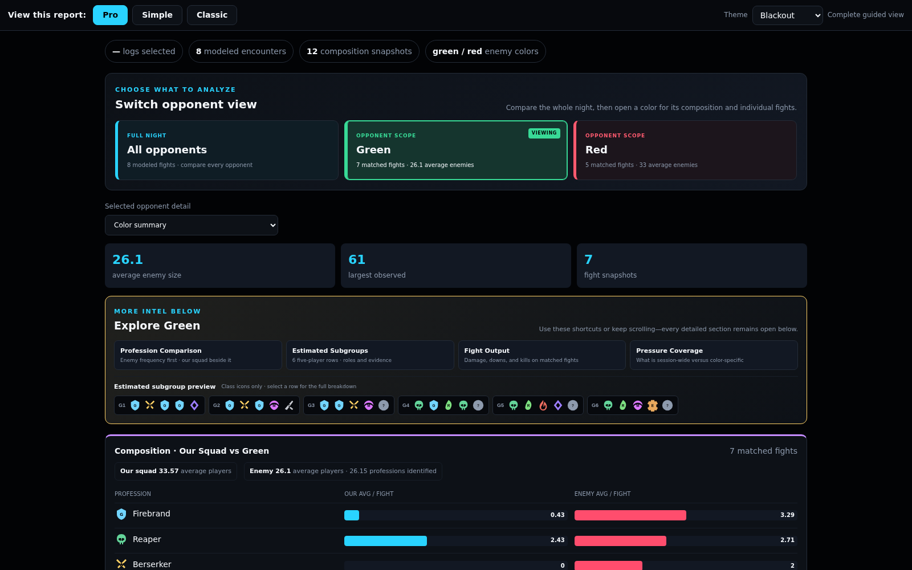

# SparkyBot

### The unhinged Guild Wars 2 WvW log analyst for Discord, Twitch, and complete end-of-night reports.

ArcDPS writes the log. SparkyBot parses the fight, posts the useful numbers,
and says what your guildies were about to say—only faster and with receipts.

Not affiliated with ArenaNet. Barely affiliated with good taste. Extremely good
at its job.

> Sparky's optional AI commentary talks trash by default. Edit the system prompt
> if you want it polite. We won't judge. Much.

## Sparky Pro 2.2.2 — *The Spreadsheet Learned Espionage*

- **Enemy Intel is the crown jewel.** Compare your squad with each enemy color,
  inspect observed professions and incoming skill pressure, then drill into
  estimated subgroups, role candidates, strips, CC, and build fingerprints.
- **One file, three levels of nerd.** Pro gives the complete guided analysis,
  Simple keeps the highlights, and Classic remains for the no-fun league.
- **Player Compare steals the homework.** Put two squad players side by side for
  damage, support, healing, weapons, rotations, skill shares, consumables, and
  provable trait evidence whenever the source exposes it.
- **It has outfits.** Reports include Graphite, Midnight, Blackout, and Studio
  Light skins. The desktop app has 11 themes and remembers your choice.

Enemy facts and estimates are labeled separately. Enemy player names stay out.
Confident nonsense is still nonsense.

## What it does

- Watches ArcDPS logs and processes completed fights automatically.
- Posts quick KDR, downs, kills, deaths, damage, and optional AI commentary.
- Builds one offline night report with sortable fights, detailed player stats,
  skill-share charts, boon/support/healing tables, high scores, and Enemy Intel.
- Supports Discord webhooks, Twitch chat, optional voice, manual file processing,
  one-button raid sessions, and guild setup files.
- Keeps AI optional. Fight parsing and reports work without it.

## Install

Requirements: [ArcDPS](https://www.deltaconnected.com/arcdps/) and the
[.NET 8 Desktop Runtime](https://dotnet.microsoft.com/en-us/download/dotnet/8.0)
used by the Guild Wars 2 Elite Insights parser.

1. Download `SparkyBot-v2.2.2-Setup.exe` from
   [Releases](https://github.com/SimpleHonors/SparkyBot/releases).
2. Double-click it.
3. Follow the first-run setup.

No Python scavenger hunt. No command prompt audition.

## Basic setup

For Discord, create a webhook under **Channel Settings → Integrations →
Webhooks**, then paste its URL into SparkyBot. Configure separate destinations
for individual fights and the final night report if wanted.

Start a run before the raid. End it afterward. SparkyBot gathers the fights,
builds the report, and can post the overview before the report file.

Settings live inside the app. Guild leaders can export a safe guild setup file;
tokens, passwords, account data, and history are not included.

## Reports and privacy

Reports are self-contained HTML files. Pro, Simple, and Classic are different
views of the same night—not three separate exports.

SparkyBot labels missing data as unavailable instead of quietly turning it into
zero. Enemy composition and skill pressure use observed combat data. Enemy
subgroups and roles remain estimates because ArcDPS does not expose everything.

Only services you configure receive data: Discord/Twitch destinations and an AI
provider when AI commentary is enabled.

## Help and source use

- [In-app help pages](docs/help/README.md)
- [Log-tool interoperability and credits](docs/WVW_LOG_TOOL_INTEROPERABILITY.md)
- Source launch: install `requirements.txt`, then run `python bootstrap.py`
- Bugs and requests: [GitHub Issues](https://github.com/SimpleHonors/SparkyBot/issues)

## Credits

SparkyBot uses the
[GW2 Elite Insights Parser](https://github.com/baaron4/GW2-Elite-Insights-Parser)
and interoperates with several community WvW log tools. Exact relationships and
license boundaries are documented in the interoperability guide above.

## License

[MIT](LICENSE). Third-party components retain their own licenses under
`THIRD_PARTY_LICENSES/`.
