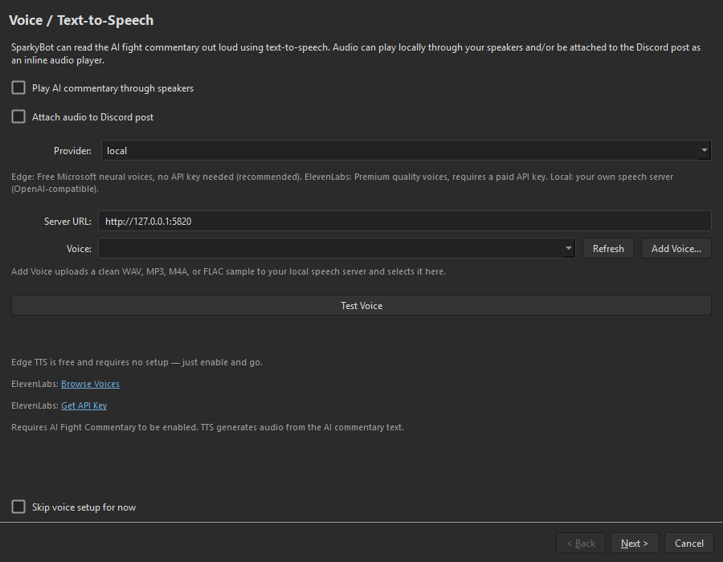
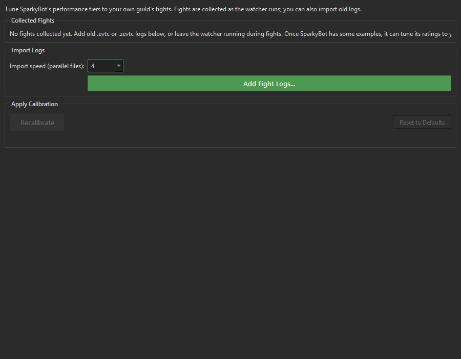

# SparkyBot v2.0.0 — It Has a Front Door Now

Version 2.0 gives SparkyBot a Home screen, a clean dark interface, and a
guided run-to-report workflow.

## Start Run. End Run. Report done.

Press **Start Run** when your squad starts. Press **End Run** when the
questionable decisions are over. SparkyBot remembers the run if it restarts,
counts fights detected or manually processed while it is open, builds the
Raid Report, and can post it to Discord.

You raid. It handles the paperwork.

## Raid Reports without the ritual

Pick the last 12 hours, today, or only the fights you want. SparkyBot reuses
work it already did while watching the raid, so reports build faster instead
of grinding through everything twice. The finished report is one shareable
HTML file with the dashboards, breakdowns, and receipts your squad deserves.

Big reports also shrink themselves before posting. Discord may still judge
your file size, but it has fewer grounds for appeal.

## A real Home screen

The activity feed shows detected and processing fights, posted and skipped
results, commentary, voice, and reports in one place. Drop `.evtc` or
`.zevtc` files straight onto the window for manual processing. Settings use
plain categories organized around Discord, fight reports, parsing, Raid
Reports, Twitch, the application, and optional AI features.

## AI is optional

The setup wizard asks before configuring AI. Say no and the AI Commentary,
Voice, Vocabulary, and Calibration screens disappear completely. SparkyBot
still handles fight reports and Raid Reports just fine. Change your mind
later if you want the robot sports commentator back.

The setup wizard presents clear choices for AI commentary, voice, and report
workflow. Local TTS users can add a voice directly from the voice setup page.

Empty Raid Report and Calibration pages explain what they need and provide a
direct action to continue.

## Native Windows installer

Download the installer, double-click it, and launch SparkyBot. No Python
installation. No command line. No pretending `pip` is a normal thing to ask
of someone who just wants fight reports.

## Also better under the hood

- Faster cached Raid Reports with honest progress and useful error details.
- Smaller self-extracting reports that usually post to Discord as plain HTML.
- Persistent records and a Poison Coverage page for the dedicated cloud
  enjoyers.
- Safer report names and more reliable report packaging.
- Temporary reports clean themselves up instead of quietly founding a
  storage empire.
- Background parsing stays out of the way while SparkyBot is running.
- Faster, bounded AI connection checks, including direct DeepSeek support.

Full changes: [CHANGELOG.md](../../CHANGELOG.md)
